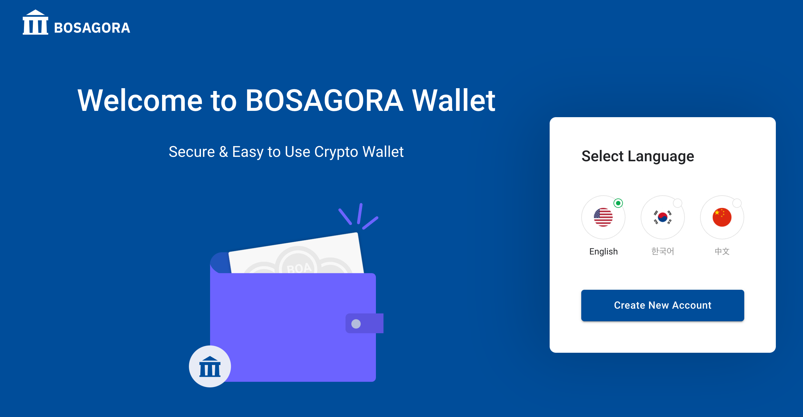
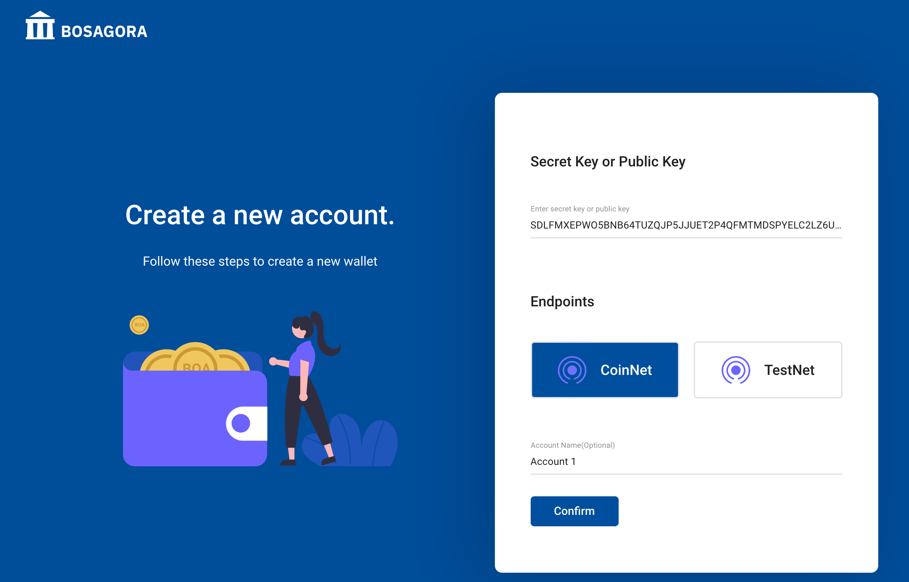

# BOSAGORA Web Wallet

## Login

When there is no registered account, The web wallet shows the login screen.  
You can choose a language here. Then, press the button **Create New Account** to move to the next screen. You can change the language using the menu **Setting** in the wallet.  

You can start the wallet by entering a secret key or public key and the name of your account, and then pressing the button **OK**. 
If you don't have a secret key or a public key, you can generate a new key by pressing the button **Create**. 
The web wallet does not keep the secret key generated here. 
You must enter a secret key when logging on the web wallet again. 
If you haven't backed up your secret key, you won't be able to use the funds transferred to the account, so be extra careful.

A detailed description of the account is provided in [Manage accounts](./01-introduction.md#Manage-accounts).
