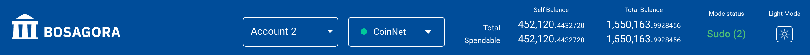

# BOSAGORA Web Wallet

## Top information

### Account selection

You can choose one of several registered accounts.  
You can also copy the public key of the account, delete the account, and add a new account.

### Network selection

There are two networks in BOSAGORA.
One is **CoinNet**, and the other is **TestNet**.
CoinNet is a network in which actual coins with value are transmitted.
TestNet is used to test, and the coins here do not have actual value.

### Balance

The web wallet shows two types of balance.  
One is the balance of the selected account, and the other is the sum of all registered accounts.
In addition, the balance can be subdivided into the following.  
**Total balance** : This is the sum of all UTXOs held by the account.  
**Spendable balance**: This is the sum of UTXO that can be spent on the account.  
**Frozen balance** : The sum of the frozen UTXO.  
**Locked balance** : This is the sum of UTXO that cannot be used for a certain period.   

There are two types of locked balances. 
The first is that the frozen UTXO is unfrozen, and the newly created UTXO is
 locked until 2016 new blocks are created. 
The second is the amount of UTXO used for the pending transaction. 
All transactions will lock the UTXO used in them until it is stored in the blockchain.

### Mode status

The public key must be registered in your account, but the secret key may not be registered. The mode of the account where the secret key is registered is **Sudo**. The mode of the account where the secret key isn't registered is **ReadOnly**.  
The web wallet shows the number of Sudo, making it easy for you to figure out the number of secret keys registered on the web wallet.
