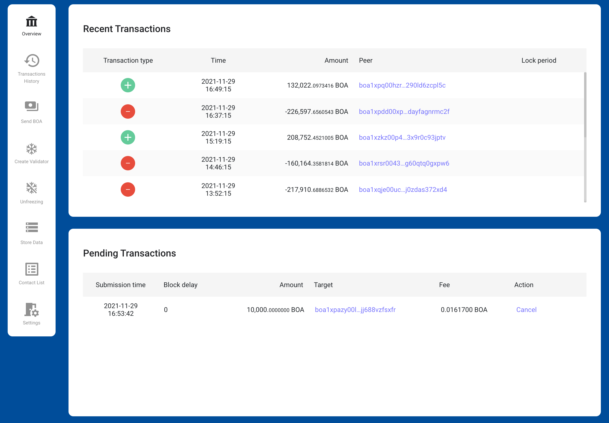

# BOSAGORA Web Wallet

## Overview

### Recent Transactions

The web wallet only shows transactions in which the address of the selected account among the recent transactions stored in the blockchain is the same as either the sender's address, or the receiver's address.  
Fields include **Transaction type**, **Time**, **Amount**, and **Peer**.  
The top record is the most recently generated transaction. 
When one record is selected, detailed transaction information is provided.  

**Transaction type** are **Inbound**, **Outbound**, **Freezing**, and **Payload**.  
**Inbound**: Funds are added to the selected account;  
**Outbound**: Funds are withdrawn from the selected account;  
**Freezing**: Used to create a validator;  
**Payload**: Used to store data in the blockchain;  
**Amount**: The amount that was received, or spent;  
**Peer**: The address that sent (or received) the funds;  

### Pending Transactions

The web wallet only shows transactions in which the address of the selected account among the transactions waiting to be stored in the blockchain is the same as one of the sender's addresses.  
Fields include **Submission time**, **Block delay**, **Amount**, **Target**, **Fee**, and **Action**.  

**Submission time**: Time at which Stoa received the transaction;  
**Block delay**: Number of blocks externalized since then;  
**Amount** Sum of all inputs in the transaction;  
**Target** Receiver address, or name if known;  
**Fee**: Fee posted for this transaction;  

Transactions that have not yet been saved in the block may be canceled. 
The success of transaction cancellation cannot be guaranteed because it may be stored in a block during the cancellation process.  
