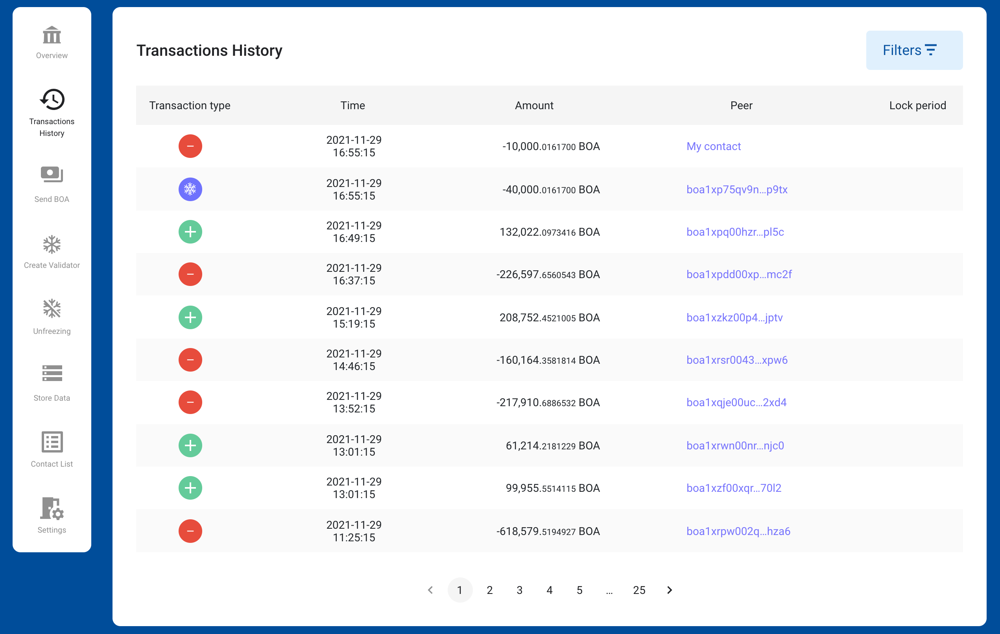

# BOSAGORA Web Wallet

## Transactions history

The web wallet only shows transactions in which the address of the selected account among the recent transactions stored in the blockchain is the same as either the sender's address, or the receiver's address.  
Fields include **Transaction type**, **Time**, **Amount**, and **Peer**.  
The top record is the most recently generated transaction. 
When one record is selected, detailed transaction information is provided.  

**Transaction type** are **Inbound**, **Outbound**, **Freezing**, and **Payload**.  
**Inbound**: Funds are added to the selected account;  
**Outbound**: Funds are withdrawn from the selected account;  
**Freezing**: Used to create a validator;  
**Payload**: Used to store data in the blockchain;  
**Amount**: The amount that was received, or spent;  
**Peer**: The address that sent (or received) the funds;  
