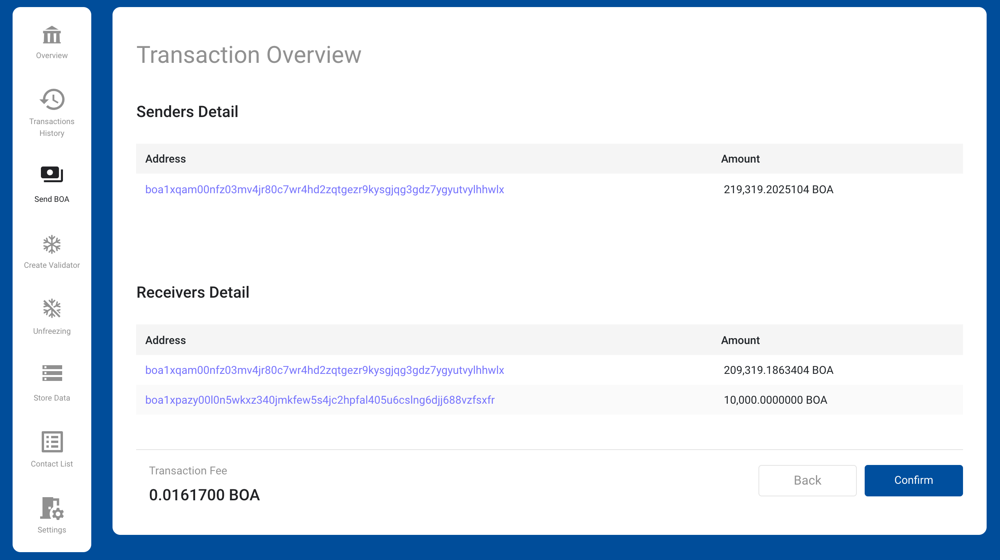

# BOSAGORA Web Wallet

## Store Data

This screen consists of three areas: **Payload**, **Fee**, and **Sender**.

### Payload

Data to be stored in the blockchain. Text encoded with Base64 must be entered.

### Fee

A detailed description of the fee is in [Transaction Fee](./01-introduction.md#transaction-fee).

### Senders

The field consists of **Address**, **Drawn**, **Remaining**, **Spendable Balance**, **Balance**, and **Action**.
You can fill the insufficient amount of transfer by adding several accounts they send. At this time, the account must be registered in the wallet first.

**Address**: The address of the added account.  
**Drawn**: The amount that would be withdrawn on the added account.  
**Remaining**: The amount needed to fill the sending amount.  
**Spendable Balance**: The sum of UTXO that can be spent on the added account.  
**Balance**: The sum of all UTXOs held by the account.  

If the `Remaining` is zero after you add one account, you no longer need to add an account. However, if the `Remaining` is greater than 0, a new account must be added.
If added account's `Remaining` is zero, it means that the sum of the spendable balances of all accounts is greater than or equal to the transfer amount. In this case, the button **Next** is activated.
When you press the button **Next** to proceed to the next step, The wallet provides a window for entering a secret key for an account with only a public key registered among the added accounts.

### Transaction Overview

When a transaction is successfully created, it shows the details of the transaction.
You must finally check the amount and address.

### Send transaction

When you click the button **OK**, the transaction is sent to the node.
If normally received by the node, you can check the pending transaction on the transaction overview screen.
Also, if the transaction has already been stored in the blockchain, you can check it in the transaction history.
