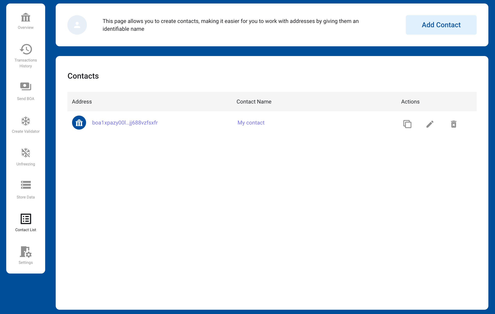

# BOSAGORA Web Wallet

## Contact List

The contact information consists of **address** and **name**.
It makes it easy and safe to transfer funds from your account to an address registered in your contact number.
Wallet also displays the transaction history as a name on behalf of the address registered in the contact.
Therefore, users can easily grasp the contents of the transaction.

### Add Contact

When the button **Add Contact** on the top right is clicked, the input window pops up.
Users can add by entering their address and contact name here.

### Edit Contact

You can change the contact's name by clicking the icon **Edit** to the right of each contact's item.

### Delete Contact

You can delete contacts by clicking the icon **Delete** to the right of each contact's item.
