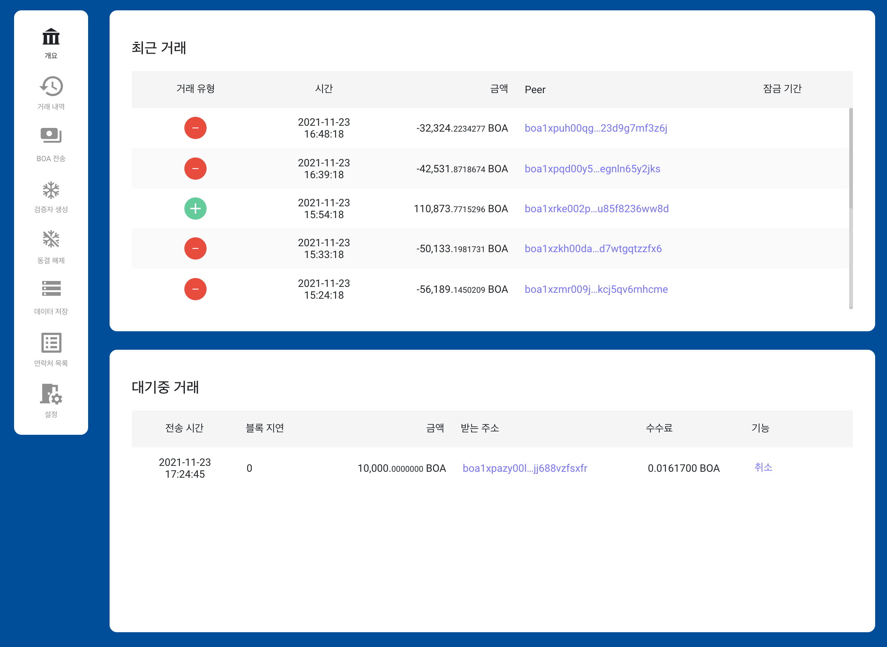

# BOSAGORA 웹 월렛

## 개요

### 최근 트랜잭션

월렛은 블록체인에 저장된 최근 트랜잭션들 중 선택된 계정의 주소가 입금주소 또는 출금주소들 중 하나와 동일한 트랜잭션만을 보여줍니다. 
필드로는 **트랜잭션유형**, **시간**, **금액**, **Peer** 이 있습니다.
가장 위의 레코드는 가장 최근에 생성된 트랜잭션입니다. 
하나의 레코드가 선택되면 상세한 트랜잭션정보가 제공됩니다.  

**트랜잭션유형**은 **입금**, **출금**, **프리징**, **페이로드**입니다. 
**입금트랜잭션**은 Peer에서 선택된 계정으로 자금이 이체된 트랜잭션입니다.  
**출금트랜잭션**은 선택된 계정에서 Peer로 자금이 이체된 트랜잭션입니다.  
**프리징**은 검증자 생성시 사용된 트랜잭션입니다.  
**페이로드**는 블록체인에 데이터를 저장하기 위해 사용된 트랜잭션입니다.  
**금액**은 전송된 자금의 양입니다.  
**Peer**는 선택된 계정에서 자금이 전송된 주소또는 선택된 계정으로 자금을 전송한 주소입니다. 

### 보류 트랜잭션

월렛은 블록체인에 저장되기 위해 대기중인 트랜잭션들 중 선택된 계정의 주소가 입금주소들 중 하나와 동일한 트랜잭션만을 보여줍니다. 
필드로는 **전송시간**, **블록지연**, **금액**, **받는주소**, **수수료**, **기능**이 있습니다.

**전송시간**은 Stoa가 트랜잭션을 수신한 시간입니다.  
**블록지연** 트랜잭션이 수신된 후에 외부화된 블록의 갯수입니다.  
**금액**은 트랜잭션내의 모든 인풋의 합계입니다.  
**받는주소**는 자금을 받는 주소입니다.  
**수수료**는 트랜잭션의 수수료입니다.  

아직 블록에 저장되지 않은 트랜잭션은 취소될 수 있습니다.  
취소되는 과정중에 블록에 저장될 가능이 있기 때문에 트랜잭션 취소의 성공은 보장될 수 없습니다.
