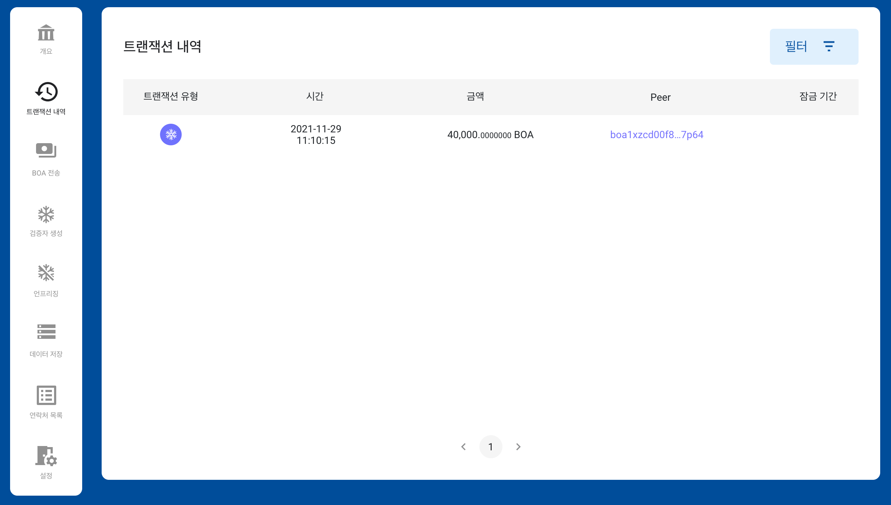

# BOSAGORA 웹 월렛

## 트랜잭션 내역

월렛은 블록체인에 저장된 트랜잭션내역들 중 선택된 계정의 주소가 입금주소 또는 출금주소들 중 하나와 동일한 트랜잭션만을 보여줍니다. 
필드로는 **트랜잭션유형**, **시간**, **금액**, **Peer**이 있습니다.
가장 위의 레코드는 가장 최근에 생성된 트랜잭션입니다. 
하나의 레코드가 선택되면 상세한 트랜잭션 내용이 제공됩니다.  

**트랜잭션유형**은 **입금**, **출금**, **프리징**, **페이로드**입니다. 
**입금트랜잭션**은 Peer에서 선택된 계정으로 자금이 이체된 트랜잭션입니다.  
**출금트랜잭션**은 선택된 계정에서 Peer로 자금이 이체된 트랜잭션입니다.  
**프리징**은 검증자 생성시 사용된 트랜잭션입니다.  
**페이로드**는 블록체인에 데이터를 저장하기 위해 사용된 트랜잭션입니다.  
**금액**은 전송된 자금의 양입니다.  
**Peer**는 선택된 계정에서 자금이 전송된 주소또는 선택된 계정으로 자금을 전송한 주소입니다. 
