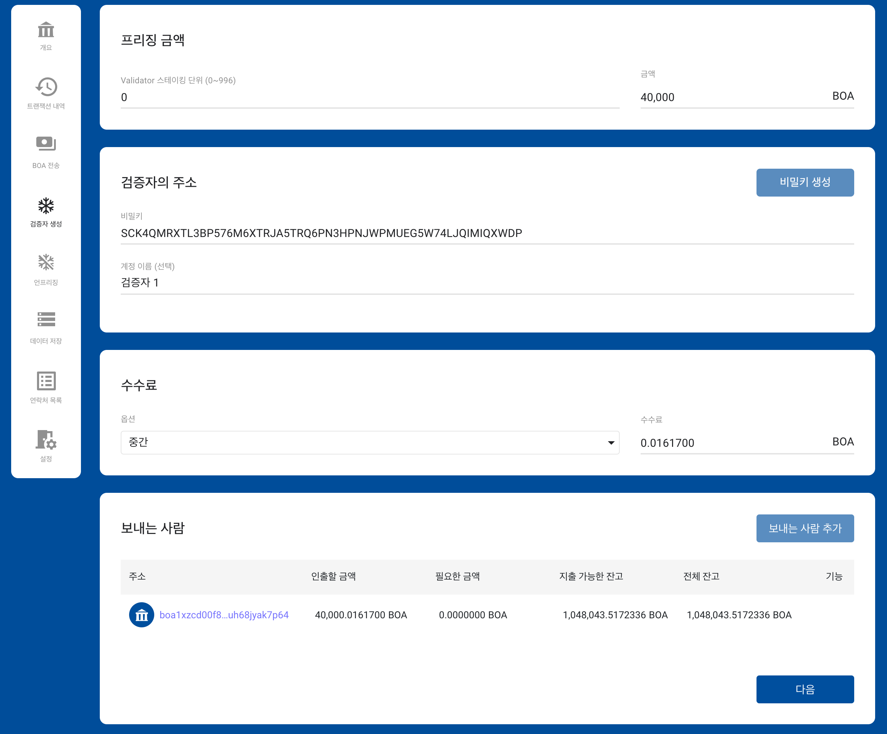
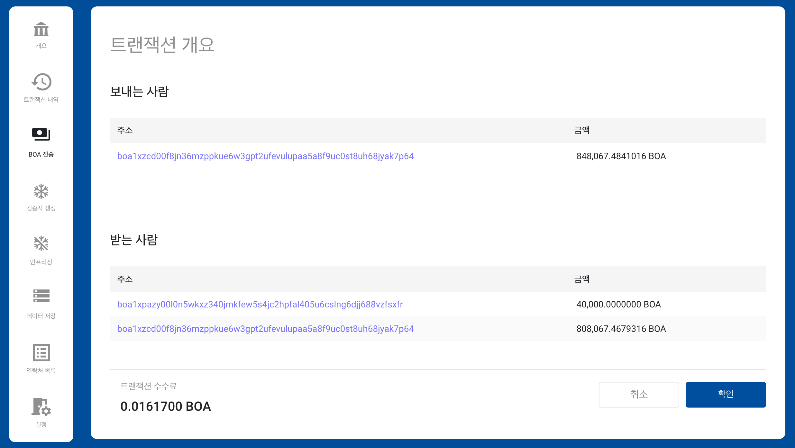

# BOSAGORA 웹 월렛

## 검증자 생성

이 화면은 **프리징 금액**, **검증자의 주소**, **수수료**, **보내는 사람** 네개의 영역으로 되어 있습니다.

### 프리징 금액

검증자가 되기 위해서는 40,000 BOA이상 프리징된 자금이 있어야 합니다. 
프리징 금액은 스테이킹 단위가 0일 때는 40,000 BOA이며 스테이킹 단위가 1증가 할 때마다 10,000 BOA씩 증가하게 됩니다.

### 검증자의 주소

검증자의 비밀키는 새롭게 만들어 사용됩니다. 
이 때 새로 만들어진 검증자의 비밀키는 계정에 바로 등록됩니다. 
사용자는 이 신규 검증자의 비밀키를 별로도 기록하고 보관하여야 합니다. 그렇지 않으면 신규계정에 전송된 자금은 사용할 수 없게 됩니다.

### 수수료

수수료에 대한 자세한 설명은 [트랜잭션의 수수료](./01-introduction.md#트랜잭션의-수수료)에 있습니다.

### 보내는 사람

필드는 **주소**, **인출할 금액**, **필요한 금액**, **지출가능한 잔고**, **전체잔고**, **기능** 으로 구성됩니다.  
사용자는 보내는 계정을 여러개 추가하여 부족한 전송금액을 채울 수 있습니다. 이 때 계정은 반드시 월렛에 먼저 등록되어 있어야 합니다.

**주소**: 추가된 계정의 주소입니다.  
**인출할 금액**: 추가된 계정에서 인출될 금액입니다.  
**필요한 금액** 전송금액을 채우기 위해 더 필요한 금액입니다.  
**지출가능한 잔고**: 추가된 계정에서 지출이 가능한 UTXO의 합계입니다.  
**전체잔고**: 추가된 계정이 가진 모든 UTXO의 합계입니다.  

사용자가 하나의 계정을 추가한 후 `필요한 금액`이 0이면 더 이상 계정을 추가할 필요가 없습니다. 그러나 `필요한 금액`이 0보다 크다면 새로운 계정을 추가하여야 합니다.
추가된 계정의 `필요한 금액`이 0이라는 의미는 모든 계정의 지출가능한 잔고의 합이 전송금액보다 크거나 같다는 것입니다. 이럴 경우 **다음** 버튼이 활성화됩니다. 
사용자가 **다음** 버튼을 눌러 다음단계로 진행했을 때, 월렛은 추가된 계정중에 공개키만 등록된 계정에 대해서 비밀키를 입력할 수 있는 창을 제공합니다.

### 트랜잭션의 확인

트랜잭션이 성공적으로 생성되면, 그 트랜잭션의 세부내용을 보여줍니다. 
사용자는 금액과 주소를 최종적으로 확인하여야 합니다.

### 트랜잭션의 전송

확인 버튼을 클릭하면 트랜잭션은 노드로 전송됩니다. 
정상적으로 노드에 접수된 경우, 사용자는 그 트랜잭션 개요 화면의 보류트랜잭션에서 확인할 수 있습니다. 
또한 그 트랜잭션이 이미 블록체인체 저장되었다면 트랜잭션의 내역에서 그것을 확인할 수 있습니다.
