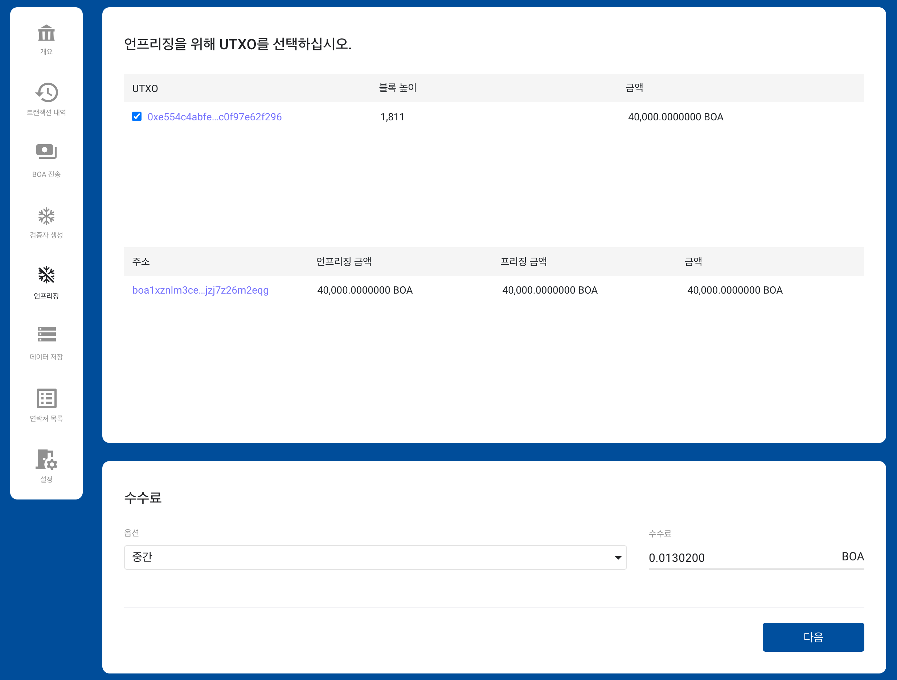

# BOSAGORA 웹 월렛

## 언프리징

이 화면은 **프리징된 UTXO의 선택**, **수수료** 두개의 영역으로 되어 있습니다.

### 프리징된 UTXO의 선택

현재 선택된 계정에 있는 프리징된 UTXO를 보여줍니다. 
사용자는 언프리징을 원하는 항목의 왼쪽 체크박스를 선택합니다.

### 수수료

수수료에 대한 자세한 설명은 [트랜잭션의 수수료](./01-introduction.md#트랜잭션의-수수료)에 있습니다.
프리징된 UTXO의 선택갯수에 따라 수수료가 변경됩니다.

### 트랜잭션의 확인

트랜잭션이 성공적으로 생성되면, 그 트랜잭션의 세부내용을 보여줍니다. 
사용자는 금액과 주소를 최종적으로 확인하여야 합니다.

### 트랜잭션의 전송

확인 버튼을 클릭하면 트랜잭션은 노드로 전송됩니다. 
정상적으로 노드에 접수된 경우, 사용자는 그 트랜잭션 개요 화면의 보류트랜잭션에서 확인할 수 있습니다. 
또한 그 트랜잭션이 이미 블록체인체 저장되었다면 트랜잭션의 내역에서 그것을 확인할 수 있습니다.
