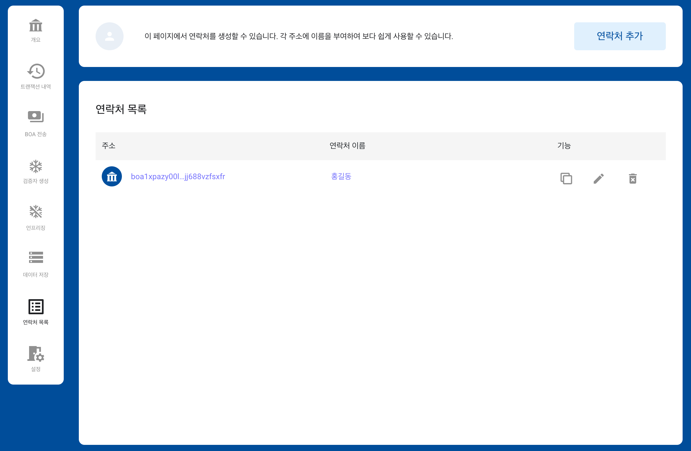

# BOSAGORA 웹 월렛

## 연락처 목록

연락처는 **주소**와 **이름**으로 구성됩니다. 
사용자의 계좌에서 연락처에 등록된 주소로 자금을 쉽고 안전하게 전송할 수 있게 해줍니다. 
또한 월렛은 트랜잭션의 이력에서 연락처에 등록된 주소를 대신하여 이름으로 표시합니다. 
따라서 사용자는 쉽게 그 트랜잭션의 내용을 쉽게 파악할 수 있습니다.

### 연락처 추가

오른쪽 상단에 있는 **연락처 추가** 버튼이 클릭되면 입력창이 팝업됩니다. 
사용자는 이곳에 주소와 연락처의 이름을 입력하여 추가 할 수 있습니다.

### 연락처 수정

사용자는 각 연락처의 항목 오른쪽 있는 **수정**버튼을 클릭하여 연락처의 이름을 변경할 수 있습니다.

### 연락처 삭제

사용자는 각 연락처의 항목 오른쪽에 있는 **삭제**버튼을 클릭하여 연락처를 삭제할 수 있습니다.
