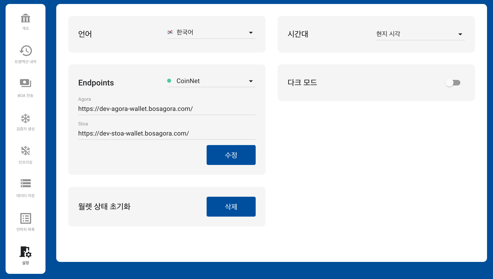

# BOSAGORA 웹 월렛

## 설정

### 언어

제공되는 언어는 **영어**, **한국어**, **중국어** 입니다.

### Endpoints

**CoinNet**과 **TestNet** 중 하나를 선택할 수 있습니다.

### 월렛 상태 초기화

저장되어 있던 계정과 연락처가 모두 삭제됩니다.

### 시간대

제공되는 시간대는 **지역시간**과 **UTC**입니다.

### 다크모드

화면의 배경색을 변경할 수 있습니다. **다크모드**와 **라이트모드**가 제공됩니다.
